# SchemaSense Architecture Guide

This guide explains SchemaSense from the point of view of a beginner reading the repository for the first time. It focuses on what each file does, what it receives as input, what it returns as output, and how the pieces cooperate.

## One-Sentence Summary

SchemaSense is a local app that takes an engineering diagram image plus a natural-language question, uses Qwen3-VL through `llama.cpp`, builds evidence such as symbol detections and a graph, then returns an answer with artifacts you can inspect.

## Big Picture

```mermaid
flowchart LR
    user[User in Browser] --> ui[Vanilla HTML CSS JS]
    ui --> api[FastAPI Backend]
    api --> orch[SchemaSense Orchestrator]
    orch --> spot[Symbol Spotting]
    orch --> graph[Connector Graph]
    orch --> reason[Graph Reasoner]
    orch --> verifier[Visual Verifier]
    spot --> vlm[local llama.cpp Qwen3-VL]
    graph --> vlm
    reason --> vlm
    verifier --> vlm
    orch --> outputs[JSON PNG Markdown Outputs]
    api --> ui
```

The important design idea is simple:

- The browser is only the interface.
- FastAPI receives requests and returns JSON.
- Python orchestration runs the pipeline.
- All model calls go to one local `llama.cpp` server.
- NetworkX stores diagram structure as a graph.
- Generated files are written under `outputs/`.

## Runtime Stack

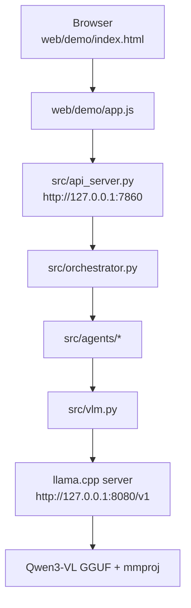

There are two local servers:

| Server | Default URL | Purpose |
|---|---|---|
| SchemaSense FastAPI | `http://127.0.0.1:7860` | Serves the UI and app endpoints |
| llama.cpp | `http://127.0.0.1:8080/v1` | Serves Qwen3-VL through an OpenAI-compatible API |

## Main User Flows

### Analyze One Diagram

```mermaid
flowchart TD
    A[Choose sample or upload image] --> B[Type question]
    B --> C[POST /api/analyze]
    C --> D[Resolve image path]
    D --> E[Run schemasense()]
    E --> F[Render detection overlay]
    E --> G[Render graph image]
    E --> H[Write latest_analysis.json]
    F --> I[Return JSON to browser]
    G --> I
    H --> I
    I --> J[Show answer, confidence, trace, artifacts]
```

Input:

- sample image name or uploaded image bytes
- free-text question
- optional baseline comparison flag

Output:

- answer
- reasoning
- confidence
- detected symbols
- graph nodes and edges
- timings
- cache status
- optional baseline answer
- artifact URLs

### Run Full Comparison

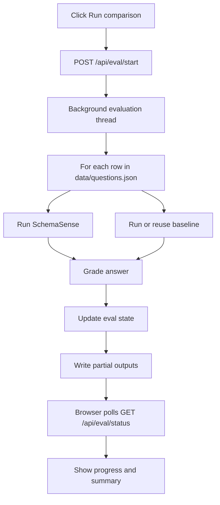

The stop button is cooperative: it asks the background thread to stop after the current question finishes.

## The Core Pipeline

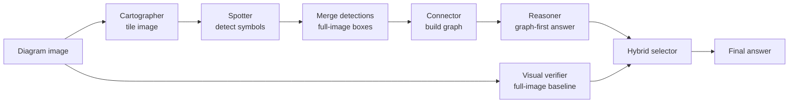

### Step 1: Cartographer

The Cartographer splits big diagrams into overlapping tiles. This makes small labels and symbols easier for the VLM to see.

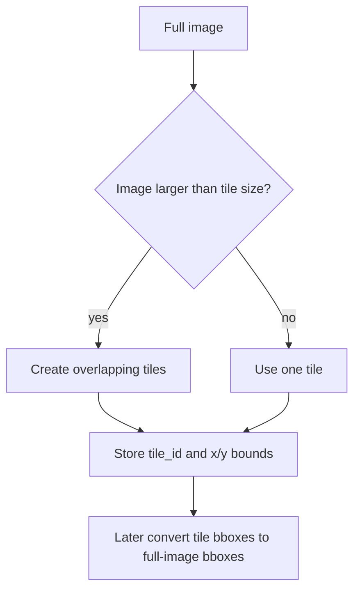

Main input:

- `PIL.Image.Image`

Main output:

- list of tile dictionaries:

```json
{
  "tile_id": "t_00_00",
  "image": "<PIL image>",
  "x1": 0,
  "y1": 0,
  "x2": 768,
  "y2": 768
}
```

### Step 2: Symbol Spotter

The Spotter asks Qwen3-VL to identify known engineering symbols and bounding boxes.

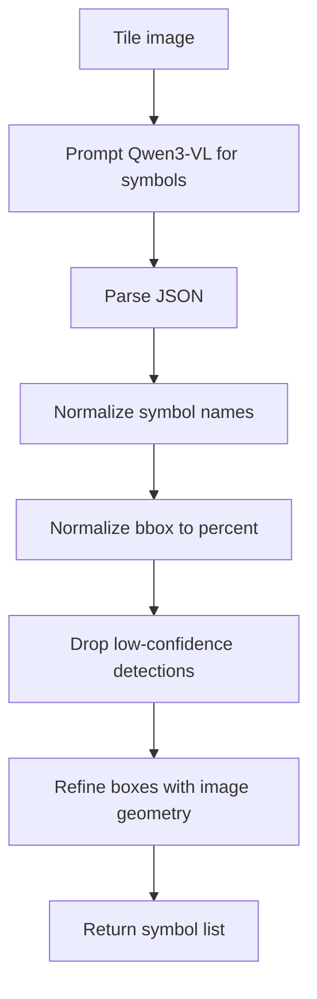

Typical detection:

```json
{
  "symbol_type": "centrifugal_pump",
  "label": "P-101",
  "bbox": [12.5, 20.0, 33.2, 42.8],
  "confidence": 0.86
}
```

### Step 3: Merge Detections

Tile detections are converted back into full-image coordinates and deduplicated.

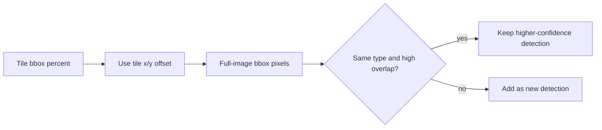

Typical merged detection:

```json
{
  "symbol_type": "motor",
  "label": "M",
  "bbox_percent": [10.0, 20.0, 30.0, 40.0],
  "bbox_absolute": [120, 80, 360, 160],
  "tile_id": "t_00_01",
  "confidence": 0.9
}
```

### Step 4: Connector

The Connector turns detections into a graph. Each detection becomes a node. Nearby detections are checked with local image crops to decide whether there is a direct pipe, wire, or line between them.

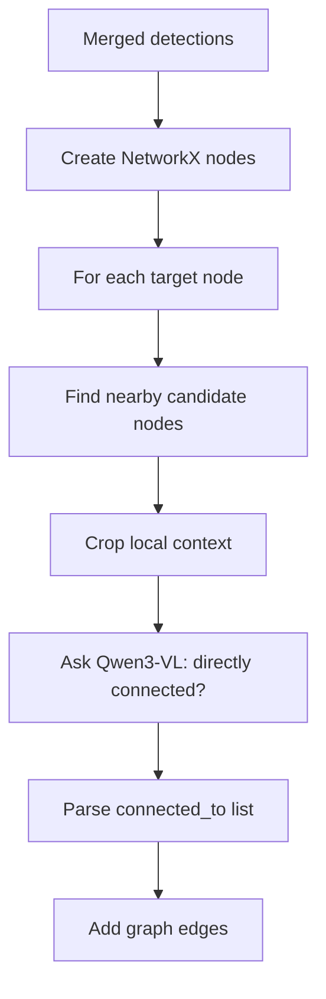

Graph node:

```json
{
  "id": "0",
  "symbol_type": "pump",
  "label": "P-101",
  "bbox": [100, 80, 160, 140],
  "confidence": 0.88
}
```

Graph edge:

```json
{
  "source": "0",
  "target": "1",
  "connection_type": "pipe"
}
```

### Step 5: Reasoner

The Reasoner first tries to answer from the graph text. If the graph is insufficient, it asks for visual lookup on a crop or full image.

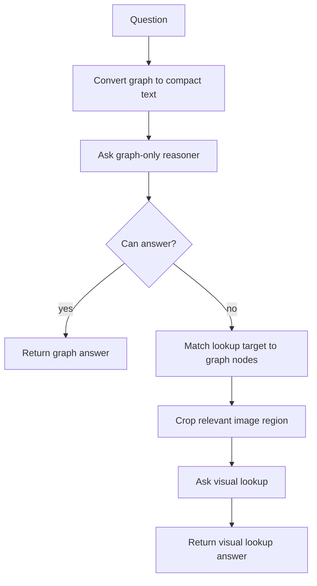

Reasoner output:

```json
{
  "answer": "Oxidizing filter",
  "reasoning": "The graph shows the pressure tank connected to the oxidizing filter.",
  "confidence": 0.82,
  "used_image_lookup": false,
  "n_reflections": 0
}
```

### Step 6: Hybrid Final Answer

SchemaSense now uses a practical hybrid strategy: graph artifacts are still produced, but a full-image visual verifier can provide the final answer when the graph is weak or when the question type benefits from visual reading.

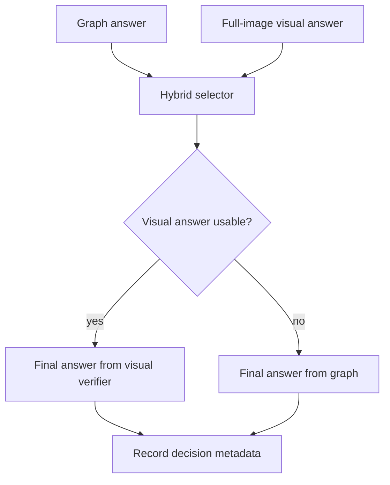

This is why the project can be defended as both:

- interpretable, because graph and detections are exposed
- practical, because final answers can use strong full-image VLM evidence

## Cache Flow

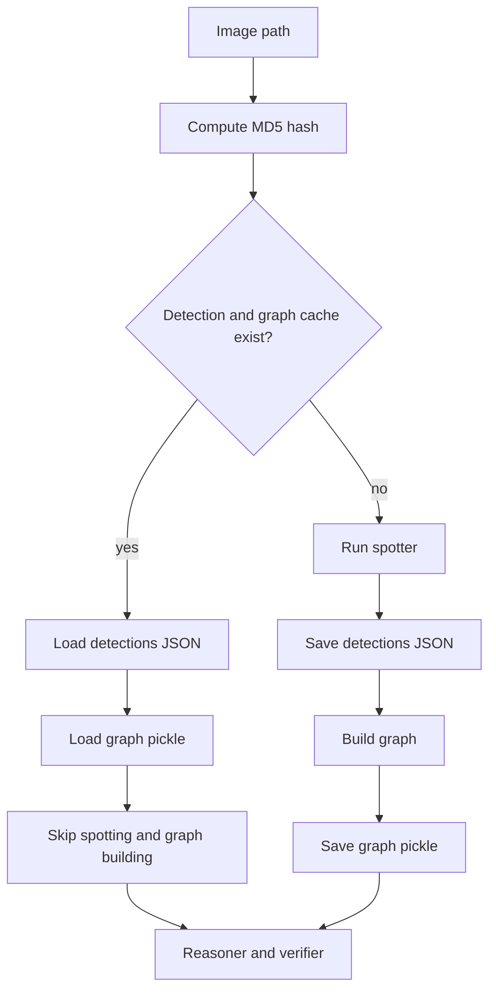

Cache files live in `data/cache/`. They are useful locally but should not be treated as source code.

## Data Shapes You See Often

### Question Row

From `data/questions.json`:

```json
{
  "id": "q01",
  "diagram": "1.png",
  "question": "How many numbered water sampling locations are shown?",
  "answer": "2",
  "type": "counting",
  "difficulty": "easy"
}
```

### Analyze API Response

Returned by `POST /api/analyze`:

```json
{
  "ok": true,
  "answer": "2",
  "reasoning": "...",
  "confidence": 0.74,
  "used_image_lookup": true,
  "symbols": [],
  "detections": [],
  "graph": {"nodes": [], "edges": []},
  "graph_stats": {"nodes": 0, "edges": 0},
  "timing": {"total_seconds": 12.3},
  "cache_hit": false,
  "outputs": {
    "spotting_image": "/outputs/spotting/1.png",
    "graph_image": "/outputs/graphs/1.png"
  }
}
```

### Evaluation Row

Written to `outputs/eval/results.json`:

```json
{
  "id": "q01",
  "diagram": "1.png",
  "predicted_ss": "2",
  "predicted_bl": "2",
  "ss_correct": true,
  "bl_correct": true,
  "ss_seconds": 18.2,
  "bl_seconds": 5.4
}
```

## File-By-File Guide

### Root Files

| File | What it does | Main inputs | Main outputs |
|---|---|---|---|
| `README.md` | Main project guide: install, run, evaluate, troubleshoot. | Human reader. | Instructions. |
| `requirements.txt` | Python dependency list. | `pip install -r requirements.txt`. | Installed packages. |
| `eval.py` | CLI evaluation runner for all rows in `data/questions.json`. | sample diagrams, questions, local VLM server. | `outputs/eval/results.json`, `outputs/eval/partial.json`, `outputs/results_table.md`. |
| `.gitignore` | Keeps local artifacts out of Git. | Git. | Ignored caches, models, generated files. |

### Documentation Files

| File | What it does | Main inputs | Main outputs |
|---|---|---|---|
| `docs/ARCHITECTURE.md` | This beginner architecture guide. | Source code and project structure. | Human-readable system explanation. |
| `docs/schemasense_presentation.html` | Single-file HTML presentation deck. | Browser. | Slides for demo/defense. |
| `docs/schemasense.pdf` | PDF academic-style report. | PDF viewer. | Written report artifact. |

### Source Package

#### `src/__init__.py`

Small package marker. It tells Python that `src` is importable as a package.

Input: none.

Output: none.

#### `src/vlm.py`

This is the only low-level client for talking to the local model server.

Important functions:

- `ask_vlm(prompt, image=None, temperature=..., json_mode=False, max_tokens=...)`
- `ask_vlm_json(prompt, image=None, retries=..., temperature=..., max_tokens=...)`

Behavior:

1. Converts PIL images into base64 `data:image/png` URLs.
2. Sends a chat completion request to llama.cpp's OpenAI-compatible API.
3. Returns text or parsed JSON.
4. Retries JSON requests with stricter prompts if the model returns invalid JSON.

Inputs:

- text prompt
- optional PIL image, image path, or list of images
- environment variables:
  - `LLAMA_CPP_BASE_URL`
  - `LLAMA_CPP_API_KEY`
  - `VLM_MODEL`
  - `VLM_TIMEOUT_SECONDS`

Outputs:

- plain string from `ask_vlm`
- `dict` or `list` from `ask_vlm_json`

Common failure:

- If llama.cpp is not running, this file raises a connection error and prints a hint.

#### `src/baseline.py`

Runs the single-shot baseline. This is the "ask Qwen3-VL directly on the full image" comparison.

Important functions:

- `baseline_answer(image_path, question)`
- `baseline_batch(questions)`

Behavior:

1. Opens the image.
2. Sends the full image plus question to Qwen3-VL.
3. Asks for JSON containing `answer` and `confidence`.
4. Falls back to answer-only mode if JSON parsing fails.

Inputs:

- image path
- question string

Outputs:

```json
{
  "answer": "short answer",
  "confidence": 0.73,
  "elapsed_seconds": 4.2
}
```

Why it exists:

- It gives a simple baseline for evaluation.
- The hybrid SchemaSense path can reuse its full-image answer as a visual verifier.

#### `src/orchestrator.py`

This is the main pipeline coordinator. If you want to understand the system behavior, start here.

Important functions:

- `schemasense(image_path, question, use_cache=True, question_type="", use_hybrid=True)`
- `batch_run(questions, use_cache=True)`
- `_hybrid_answer(...)`
- `_should_use_visual_fallback(...)`
- `_select_hybrid_answer(...)`

Behavior:

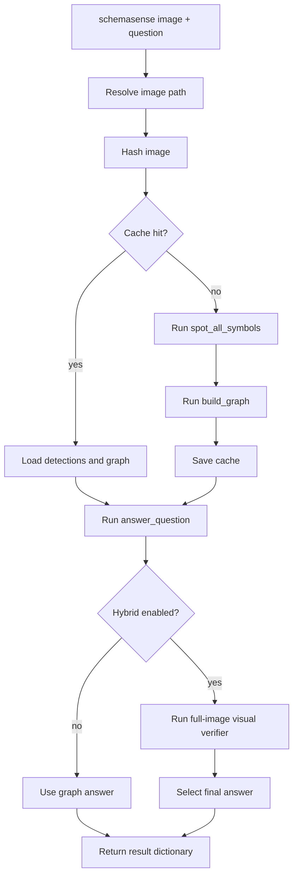

Inputs:

- image path
- question text
- cache flag
- optional question type
- hybrid flag

Outputs:

- final answer
- graph answer
- visual answer, if used
- hybrid decision metadata
- detections
- graph
- graph stats
- timing
- cache status
- connector warnings

Important behavior to know:

- The graph pipeline always runs so artifacts are available.
- The final answer often comes from the full-image visual verifier because it improves practical accuracy.
- The cache key is based on image MD5, not question text. This is correct because detections and graph depend on the image.

#### `src/pipeline_spotting.py`

Wraps tiling plus symbol spotting into one reusable function.

Important functions:

- `spot_all_symbols(image, use_cache=True)`
- `draw_detections(image, detections, out_path)`

Behavior:

1. Checks detection cache.
2. Tiles the image.
3. Runs `spot_symbols()` on every tile.
4. Merges tile detections into full-image detections.
5. Optionally draws colored bounding boxes.

Inputs:

- PIL image
- cache flag
- detection list for drawing

Outputs:

- list of merged detections
- overlay PNG when drawing
- detection JSON when run as script

#### `src/visualize.py`

Creates presentation/report-style figures from saved pipeline outputs.

Important functions:

- `make_pipeline_figure(image_path, out_path)`
- `make_answer_figure(image_path, question, result, out_path)`

Behavior:

- Reads cached detections and graph outputs.
- Builds Matplotlib figures showing image, detections, graph overlay, and answer panel.

Inputs:

- image path
- result dictionary
- cached artifacts

Outputs:

- PNG figure files, usually under `outputs/figures/`

#### `src/api_server.py`

The FastAPI backend. This file connects the frontend to the Python pipeline.

Main responsibilities:

- serve the HTML UI
- list sample diagrams
- parse uploads
- validate image files
- run analysis
- run baseline comparison
- manage evaluation background thread
- expose generated output files

Important endpoints:

| Endpoint | Method | Input | Output |
|---|---:|---|---|
| `/` | GET | none | `web/demo/index.html` |
| `/api/health` | GET | none | model/server/status info |
| `/api/diagrams` | GET | none | sample diagram list |
| `/api/questions` | GET | none | evaluation question list |
| `/api/demo/state` | GET | none | diagrams, questions, telemetry, outputs |
| `/api/analyze` | POST | multipart form or JSON | full SchemaSense result |
| `/api/baseline` | POST | image + question | baseline answer |
| `/api/eval/start` | POST | none | starts background comparison |
| `/api/eval/stop` | POST | none | asks comparison to stop |
| `/api/eval/status` | GET | none | current comparison progress |
| `/api/outputs/latest` | GET | none | recent output files |

Important input rules:

- Uploads must be images: PNG, JPG, JPEG, WEBP, BMP, TIFF.
- Upload max size is 20 MB.
- PDF uploads are intentionally not supported.

Output behavior:

- `/api/analyze` writes `outputs/analysis/latest_analysis.json`.
- It also writes rendered artifacts under `outputs/spotting/`, `outputs/graphs/`, and `outputs/figures/`.
- Evaluation endpoints write `outputs/eval/*.json` and `outputs/results_table.md`.

### Agent Files

#### `src/agents/__init__.py`

Package marker for the agent modules.

#### `src/agents/cartographer.py`

Responsible for spatial tiling and coordinate conversion.

Important functions:

- `tile_image(image, tile_size=768, overlap=0.2)`
- `bbox_tile_to_full(bbox_percent, tile, full_image)`
- `merge_detections(tile_results, iou_threshold=0.4)`
- `iou(a, b)`

Inputs:

- PIL image
- tile-relative detection boxes

Outputs:

- tile dictionaries
- full-image pixel bounding boxes
- merged detection list

Beginner mental model:

The Cartographer is the map maker. It remembers where every tile came from so a box found inside a tile can be placed back onto the original full diagram.

#### `src/agents/spotter.py`

Responsible for asking the VLM to find symbols and for cleaning up those detections.

Important functions:

- `spot_symbols(image)`
- `_build_prompt(symbol_list)`
- `_post_process(...)`
- `_normalize_symbol_type(...)`
- `_normalize_bbox(...)`
- `_dedupe_symbols(...)`
- `_refine_symbols_with_image(...)`
- `annotate_image(...)`
- `save_spotter_result(...)`

Inputs:

- tile image
- model JSON response

Outputs:

- normalized symbol detections
- optional annotated image
- optional JSON result

Behavior:

1. Builds a prompt listing canonical symbol types.
2. Asks the VLM for visible symbols, labels, boxes, and confidence.
3. Accepts JSON object or list formats.
4. Normalizes boxes into percent coordinates.
5. Drops boxes below the confidence threshold.
6. Deduplicates overlapping same-type symbols.
7. Uses simple image-processing heuristics to refine some boxes.

Beginner mental model:

The Spotter is the "what objects do you see?" agent.

#### `src/agents/connector.py`

Responsible for building the NetworkX graph.

Important functions:

- `build_graph(image, detections)`
- `graph_to_dict(g)`
- `graph_to_text(g)`
- `_context_window(...)`
- `_annotated_context_crop(...)`
- `_connection_prompt(...)`
- `_parse_connections(...)`
- `_add_or_update_edge(...)`
- `_draw_graph_topology(...)`

Inputs:

- full image
- merged detections with absolute boxes

Outputs:

- `networkx.Graph`
- JSON-friendly graph dictionary
- compact text graph for prompts
- optional graph PNG

Behavior:

1. Adds one graph node per detection.
2. For each node, finds nearby candidates.
3. Crops the local region around the target node.
4. Draws target and candidate labels on the crop.
5. Asks Qwen3-VL which candidates are directly connected.
6. Adds edges with `connection_type`.
7. Stores warnings and query counts in `graph.graph`.

Beginner mental model:

The Connector is the "which components touch or connect?" agent.

#### `src/agents/reasoner.py`

Responsible for answering questions using graph evidence first.

Important functions:

- `answer_question(question, graph, image, max_reflections=2)`
- `_ask_graph_only(...)`
- `_ask_visual_lookup(...)`
- `_match_nodes(...)`
- `_crop_for_lookup(...)`
- `_graph_excerpt(...)`

Inputs:

- question string
- NetworkX graph
- full image

Outputs:

- answer dictionary:

```json
{
  "answer": "controller",
  "reasoning": "The graph/crop indicates ...",
  "used_image_lookup": true,
  "n_reflections": 1,
  "confidence": 0.8
}
```

Behavior:

1. Converts the graph to text.
2. Asks the VLM if the answer is available from graph text.
3. If not, matches the requested lookup target to graph nodes.
4. Crops the relevant region.
5. Asks the VLM to answer from that crop.
6. Fails safely with `answer: "unknown"` if something breaks.

Beginner mental model:

The Reasoner is the "use the evidence to answer the question" agent.

### Frontend Files

#### `web/demo/index.html`

Defines the UI structure.

Inputs:

- loaded by the browser from FastAPI
- user actions: upload, sample selection, question typing, button clicks

Outputs:

- DOM elements that `app.js` fills with data

Main sections:

- sidebar controls
- Analyze tab
- Comparison tab
- answer card
- pipeline artifacts
- trace and telemetry panels

#### `web/demo/styles.css`

Defines the visual design.

Inputs:

- HTML classes and IDs

Outputs:

- layout, typography, tabs, cards, progress bars, responsive behavior

Design style:

- academic paper-like theme
- restrained colors
- dense but readable UI
- no framework dependency

#### `web/demo/app.js`

All browser logic.

Important functions:

- `init()`
- `analyze()`
- `renderAnswer(data)`
- `renderPipeline(data)`
- `renderTrace(data)`
- `startEvaluation()`
- `stopEvaluation()`
- `fetchEvalStatus()`
- `renderEvaluation(job)`

Inputs:

- `/api/demo/state`
- `/api/analyze`
- `/api/eval/start`
- `/api/eval/stop`
- `/api/eval/status`
- user file uploads and text input

Outputs:

- updates the DOM
- shows answer and metrics
- displays output images
- shows full comparison progress

Beginner mental model:

`app.js` never understands diagrams itself. It only sends requests to the backend and paints the returned JSON onto the page.

### Data Files

#### `data/questions.json`

The benchmark question set.

Each row has:

- `id`
- `diagram`
- `question`
- `answer`
- `type`
- `difficulty`

Used by:

- frontend sample question prefill
- CLI evaluation
- web comparison tab

#### `data/diagrams/*.png`

Sample engineering diagrams used by the demo and evaluation.

Current files:

- `1.png`
- `2.png`
- `3.png`
- `4.png`
- `5.png`
- `6.png`
- `7.png`
- `8.png`
- `9.png`
- `10.png`
- `11.png`
- `12.png`
- `13.png`
- `14.png`
- `15.png`

Inputs:

- selected by user or evaluation runner

Outputs:

- none directly; they are source/demo data

#### `data/cache/`

Local generated cache folder.

Contains:

- `*_detections.json`
- `*_graph.pkl`
- uploaded images under `uploads/` when users upload from the UI

Used by:

- `src/orchestrator.py`
- `src/pipeline_spotting.py`
- `src/api_server.py`

Packaging note:

This folder is local-only generated state. It is useful during development but usually should not be committed.

### Output Files

`outputs/` is generated at runtime. The important folders are:

| Path | Meaning |
|---|---|
| `outputs/analysis/latest_analysis.json` | Latest single analysis response |
| `outputs/eval/partial.json` | Evaluation progress snapshot |
| `outputs/eval/results.json` | Final evaluation rows |
| `outputs/results_table.md` | Human-readable evaluation table |
| `outputs/spotting/` | Detection JSON and overlay PNGs |
| `outputs/graphs/` | Graph JSON and graph PNGs |
| `outputs/figures/` | Report/demo figures |
| `outputs/cartography/` | Tiling visualizations |

These are outputs, not source code.

### Tests

The tests are focused unit tests for the risky parts of the pipeline.

| File | What it checks |
|---|---|
| `tests/__init__.py` | Test package marker. |
| `tests/test_cartographer.py` | Tiling, coordinate conversion, IoU merging. |
| `tests/test_spotter_bbox.py` | Bounding-box normalization and image-aware refinement. |
| `tests/test_pipeline_spotting.py` | Spotting pipeline cache and drawing behavior. |
| `tests/test_connector.py` | Graph construction and edge parsing. |
| `tests/test_reasoner.py` | Graph-first answers, visual lookup, safe failure. |
| `tests/test_orchestrator.py` | Pipeline cache reuse and hybrid visual verifier behavior. |

## Important Function Call Chains

### From Browser Analyze Button To Final Answer

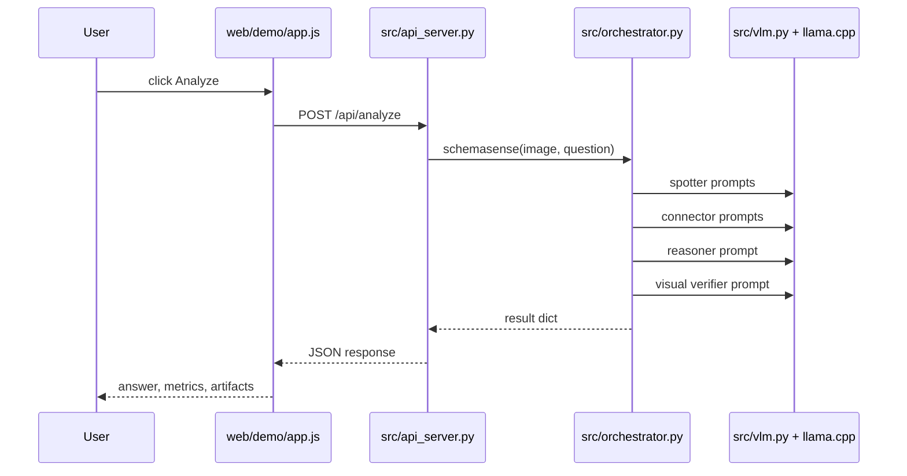

### From Evaluation Button To Results Table

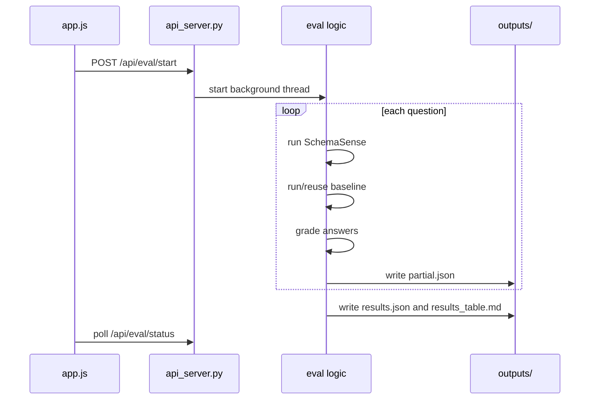

## Local-Only Boundaries

SchemaSense is designed to stay local.

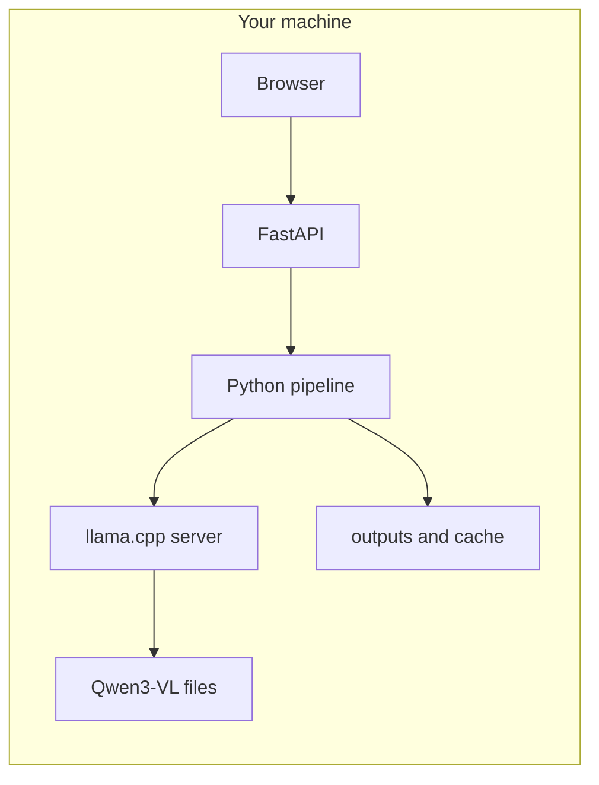

No cloud API is required by the app itself. The only network call used during normal operation is from Python to the local llama.cpp server.

## What To Read First

If you are new to the repo, read in this order:

1. `README.md` for setup and running.
2. `src/orchestrator.py` for the main pipeline.
3. `src/api_server.py` for how the UI calls the pipeline.
4. `src/agents/cartographer.py` for tiling.
5. `src/agents/spotter.py` for detections.
6. `src/agents/connector.py` for graph construction.
7. `src/agents/reasoner.py` for graph-first answering.
8. `web/demo/app.js` for frontend behavior.

## Common Beginner Questions

### Is this really multi-agent?

Yes, in the practical local sense. The agents are Python modules with specialized prompts and responsibilities. They are not LangChain or LangGraph agents. That is intentional.

### Does every agent load its own model?

No. All agents share one local Qwen3-VL server through `src/vlm.py`.

### Why build a graph if the visual verifier often gives the final answer?

Because the graph provides inspectable evidence. The final answer can use the visual verifier for robustness, while the graph remains useful for debugging, explanation, and defense.

### Why is the cache image-based and not question-based?

Detections and graph construction depend on the image, not the question. Once the image is processed, many different questions can reuse the same detections and graph.

### Why are outputs saved to disk?

For demo and debugging. The app can show overlays, graph images, JSON artifacts, and evaluation tables without rerunning expensive VLM calls.

## Packaging Checklist

Before submitting or pushing:

- Keep source code: `src/`, `web/`, `tests/`, `eval.py`, `requirements.txt`.
- Keep documentation: `README.md`, `docs/`.
- Keep sample data if allowed: `data/diagrams/`, `data/questions.json`.
- Keep selected final evaluation table: `outputs/results_table.md`.
- Do not commit `models/`.
- Do not commit `__pycache__/`.
- Usually do not commit `data/cache/`.
- Usually do not commit bulky generated output folders unless required for the demo.

